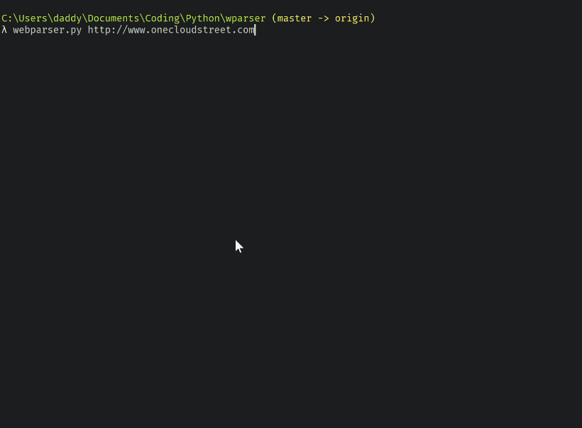

Web Crawler exercise - thought progress:
I initialy looked at the option of crawling/downloading a site using
wget. After doing some research and checking this page
(https://www.labnol.org/software/wget-command-examples/28750/) it
appeared that the following wget command would retrieve the site:

`wget ‐‐output-file=logfile.txt ‐‐recursive -nd ‐‐spider http://wiprodigital.com`

It seemed to work but the log file generated contains more than what we
are trying to generate and would need parsing. There are probably ways
to do this parsing with regular expression and a corresponding shell
utility but this is not something I am immediately familiar with.

I then looked into doing this with Python. I recalled mentions of
*Beautiful Soup* as a web scraper library that may be of use here.
In order to retrieve the HTML content and parse it we need to use the
library *requests* (to issue the HTTP request) and *beautifulsoup* to
parse the content and navigate it.  We want this to be a CLI tool so
we can use the *argparse* library to manage arguments elegantly. I also
used the *tldextract* library in order to retrieve the top level domain
of the URL.
The overall flow of the script is to parse all the links of a page, display
and recursively go through each (valid) link again.

I aimed to create a CLI python application which can take the
following arguments:

> `webparser.py http://someurl.com`

* required: URL to scrape
* Option: -i only show links for the current domain
* Option: -e only show links for external sites

----

_usage: webparser.py [-h] [-i] [-e] url_

> Crawl URL and list all `<a>` links found

> positional arguments:
> `url             the URL to crawl - for example: http://onecloudstreet.com`

> optional arguments:
> `-h, --help      show this help message and exit`

> `-i, --internal  only list internal links (to the TLD)`

> `-e, --external  only list external links (to the TLD)`

*Potential Improvements*
* Handling relative links (<a href="/pages/"...>)
* detecting/filtering on https vs http links
* use a set (no duplicates) to track unique links
* better visual representation (indentation with tabulations)

